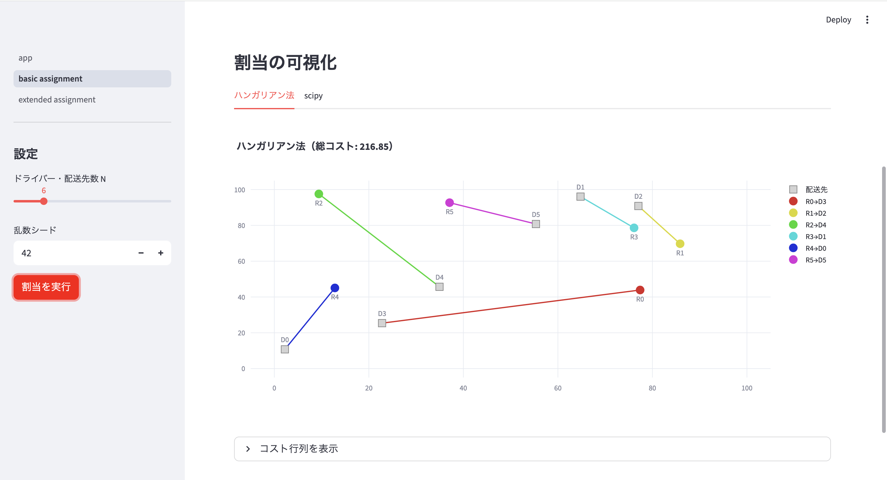

# マッチング・割当最適化（Matching & Assignment Optimizer）

配送ドライバーの割当問題を題材に、ハンガリアン法（LP双対性・KKT条件に基づくスクラッチ実装）・scipy・MIPの3手法で比較実装したポートフォリオです。

👉 **LP双対性・相補性条件（KKT条件）の理論を踏まえたハンガリアン法の実装と、1対多割当への拡張をインタラクティブに確認できます。**


---

## 解決できる課題

- ハンガリアン法がなぜ最適解を保証できるのかをLP双対性・KKT条件から理解したい
- 1対1割当（ハンガリアン法）と1対多割当（MIP）の違いを実装レベルで確認したい
- 最適性保証のある手法を実務でどう使い分けるかを理解したい

---

## 想定ユースケース

- 配送ドライバーの最適ルート割当
- 人員・タスクのマッチング（採用・プロジェクトアサイン）
- 工場設備・作業者の割当最適化

---

## デモ

### アプリ画面


### デモURL
Streamlit Cloud でインタラクティブデモを公開しています。  
→ **https://matching-assignment-egkl6rdruxeuwwugvgqhk3.streamlit.app/**

---

## 問題設定

### 基本問題：1対1割当

N人のドライバーをN件の配送先に1対1で割り当て、総移動コストを最小化する。

$$\min \sum_{i=1}^{N} \sum_{j=1}^{N} c_{ij} x_{ij}$$

$$\text{s.t.} \quad \sum_{j} x_{ij} = 1 \quad \forall i, \qquad \sum_{i} x_{ij} = 1 \quad \forall j, \qquad x_{ij} \in \{0, 1\}$$

制約行列が全単模（Totally Unimodular）のため、LP緩和の最適解が自動的に整数値になります。

### 拡張問題：1対多割当

M人のドライバー（M ≤ N）がN件の配送先を分担する。1人が最大capacity件まで担当可能。

$$\min \sum_{i=1}^{M} \sum_{j=1}^{N} c_{ij} x_{ij}$$

$$\text{s.t.} \quad \sum_{i} x_{ij} = 1 \quad \forall j, \qquad \sum_{j} x_{ij} \leq \text{capacity} \quad \forall i, \qquad x_{ij} \in \{0, 1\}$$

---

## 実装アルゴリズム

| 手法 | 実装 | 最適性 | 対応問題 |
|---|---|---|---|
| ハンガリアン法 | スクラッチ実装（双対上昇法） | 厳密解 | 1対1割当 |
| scipy | linear_sum_assignment | 厳密解 | 1対1割当 |
| MIP | PuLP + CBC | 厳密解 | 1対多割当 |

---

## ハンガリアン法とLP双対性

ハンガリアン法は「双対変数（行・列ポテンシャル）を管理しながら相補性条件を満たす完全マッチングを見つける」手続きであり、LPの双対上昇法と等価です。

**KKT条件（最適性の必要十分条件）：**

| 条件 | 内容 | アルゴリズム上の対応 |
|---|---|---|
| 主問題実行可能 | 完全マッチングが存在する | 拡張路探索でマッチングを構築 |
| 双対問題実行可能 | $u_i + v_j \leq c_{ij}$ | δ更新で常に維持 |
| 相補性条件 | $x_{ij}=1 \Rightarrow u_i + v_j = c_{ij}$ | 0要素上のみマッチングを許可 |

終了時点でKKT条件が全て成立するため、最適性が保証されます。

**δ操作の意味：**  
ラベル付き行・列のポテンシャルをδだけ更新することで、既存の0要素（相補性条件を満たす候補）を壊さずに新しい0要素を生成します。このδ更新のたびに双対目的関数値は厳密に増加し、最終的に主双対ともに最適な解へ収束します。

---

## アプリ構成

- **ページ1：基本割当**  
  ハンガリアン法スクラッチ vs scipy を同一問題で実行し、割当結果・総コスト・実行時間を比較します。地図上にドライバーと配送先を配置し、割当ラインを色分けして可視化します。

- **ページ2：拡張割当**  
  MIPによる1対多割当を可視化します。ドライバー数・配送先数・capacity・バランス制約をサイドバーで設定でき、担当件数の偏りとコストのトレードオフを確認できます。

---

## 関連記事

- （Qiita記事1：公開後追記）
- （Qiita記事2：公開後追記）

### 前提知識
- [MIPを理解するためのLP入門：単体法・内点法をPythonで実装する](https://qiita.com/Haru8-8/items/2fb9c7c870611434669f)
- [ハンガリアン法を理解するためのLP双対性入門：Shadow Priceから割り当て問題へ](https://qiita.com/Haru8-8/items/559ab30567e7b6e4f639)

---

## ファイル構成

```
matching-assignment/
├── app.py                      # トップページ（概要・手法説明）
├── requirements.txt
├── pages/
│   ├── 1_basic_assignment.py   # 基本割当（ハンガリアン法 vs scipy）
│   └── 2_extended_assignment.py # 拡張割当（MIP）
├── solvers/
│   ├── hungarian.py            # ハンガリアン法スクラッチ実装
│   └── mip_assignment.py       # MIP（PuLP/CBC）
└── utils/
    └── cost_matrix.py          # 座標生成・距離行列計算
```

---

## ローカルで実行

```bash
pip install -r requirements.txt
streamlit run app.py
```

### 各ソルバーの単体実行

```bash
python solvers/hungarian.py
python solvers/mip_assignment.py
```

---

## 技術スタック

| 分類 | 技術 |
|---|---|
| 最適化（ハンガリアン法） | スクラッチ実装（双対上昇法） |
| 最適化（MIP） | PuLP + CBC |
| 最適化（ライブラリ比較） | scipy.optimize.linear_sum_assignment |
| フレームワーク | Streamlit |
| グラフ描画 | Plotly |
| データ処理 | pandas, NumPy |

---

## 技術的なポイント

- **双対上昇法によるスクラッチ実装**：行・列ポテンシャル（双対変数）を明示的に管理し、δ更新のたびに双対目的関数が厳密に増加することを確認できる実装。KKT条件の成立をコード上で追跡可能
- **拡張路探索（ラベリング）**：BFSで未マッチング行から0要素を辿り、既存マッチングを組み替える拡張路を発見。複数ドライバーのマッチングを一度に最適化
- **MIPによる拡張**：1対1制約を緩和して1対多割当に拡張。バランス制約（担当件数の均等化）をオプションで追加し、コスト最適とバランスのトレードオフを可視化
- **ブロードキャストによる距離行列計算**：NumPyのブロードキャストで全ドライバー×配送先の組み合わせを一括計算

---

## 備考

LP双対性・ハンガリアン法を学んだ後の「理論から実装へ」の橋渡しとして開発したポートフォリオです。双対変数の動きをコード上で追跡できる実装を目指し、KKT条件による最適性保証の仕組みを実装レベルで示しています。

---

## ライセンス

[MIT License](LICENSE)